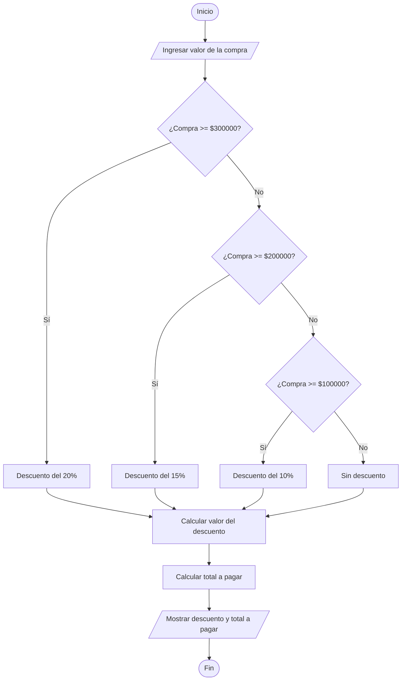

```mermaid
flowchart TD

A([Inicio]) --> B[/Ingresar valor de la compra/]

B --> C{"¿Compra >= $300000?"}

C -->|Sí| D["Descuento del 20%"]
C -->|No| E{"¿Compra >= $200000?"}

E -->|Sí| F["Descuento del 15%"]
E -->|No| G{"¿Compra >= $100000?"}

G -->|Sí| H["Descuento del 10%"]
G -->|No| I["Sin descuento"]

D --> J["Calcular valor del descuento"]
F --> J
H --> J
I --> J

J --> K["Calcular total a pagar"]

K --> L[/Mostrar descuento y total a pagar/]

L --> M([Fin])
```