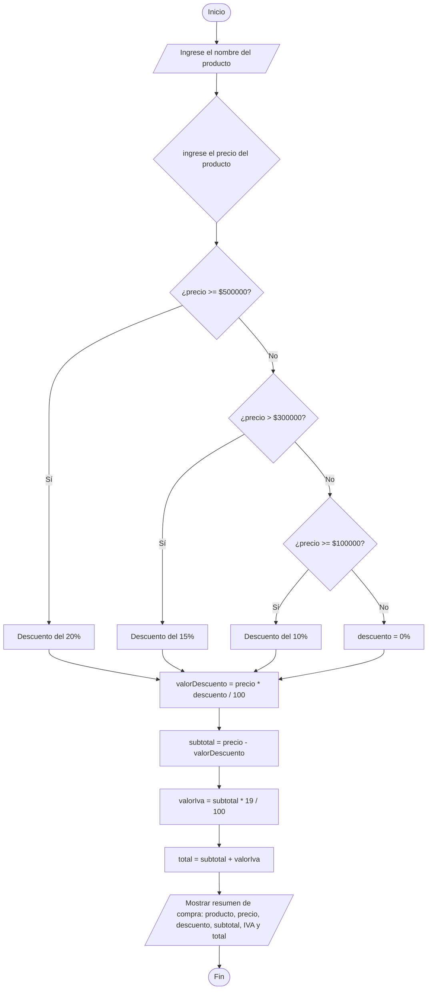

```mermaid
flowchart TD

A([Inicio]) --> B[/Ingrese el nombre del producto/]

B --> C{"ingrese el precio del producto"}

C --> D{"¿precio >= $500000?"}

D -->|Sí| E["Descuento del 20%"]
D -->|No| F{"¿precio > $300000?"}

F -->|Sí| G["Descuento del 15%"]
F -->|No| H{"¿precio >= $100000?"}

H -->|Sí| I["Descuento del 10%"]
H -->|No| J["descuento = 0%"]

E --> K["valorDescuento = precio * descuento / 100"]
G --> K
I --> K
J --> K

K --> L["subtotal = precio - valorDescuento"]

L --> M["valorIva = subtotal * 19 / 100"]

M --> N["total = subtotal + valorIva"]

N --> O[/Mostrar resumen de compra: producto, precio, descuento, subtotal, IVA y total/]
    O --> P([Fin])
```